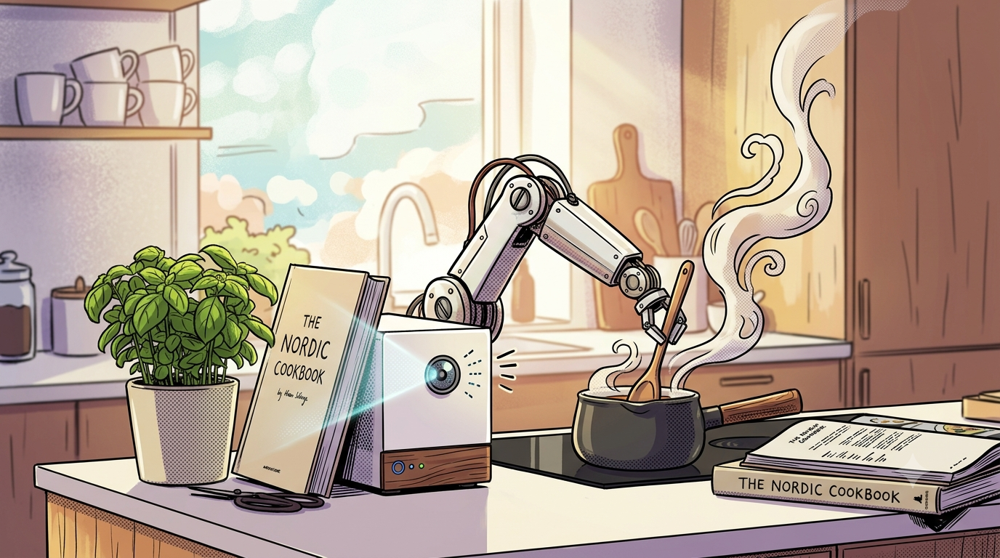
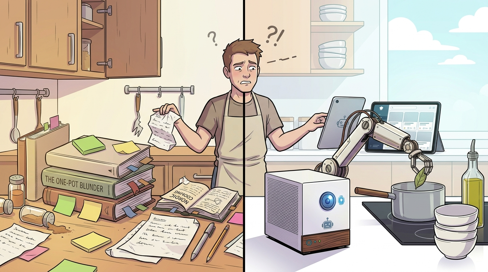
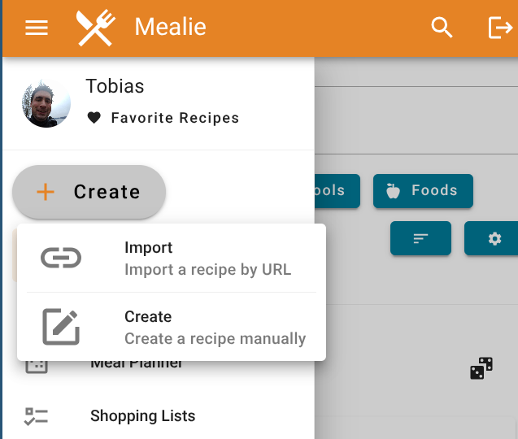
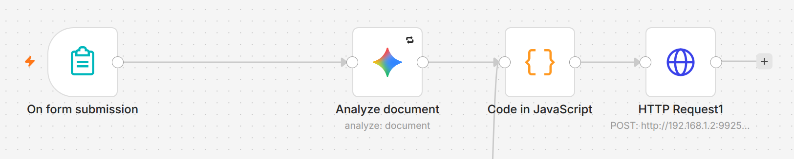
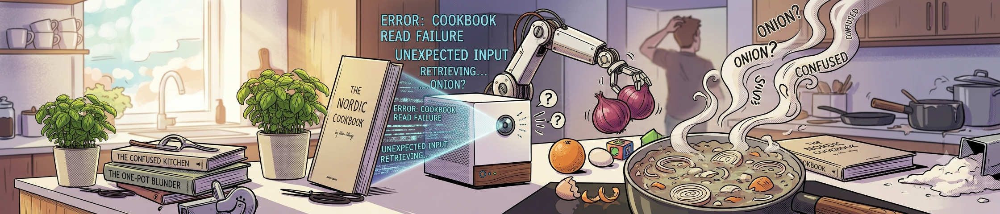
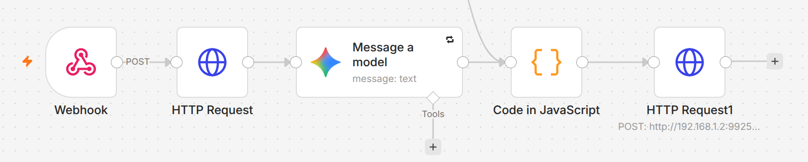
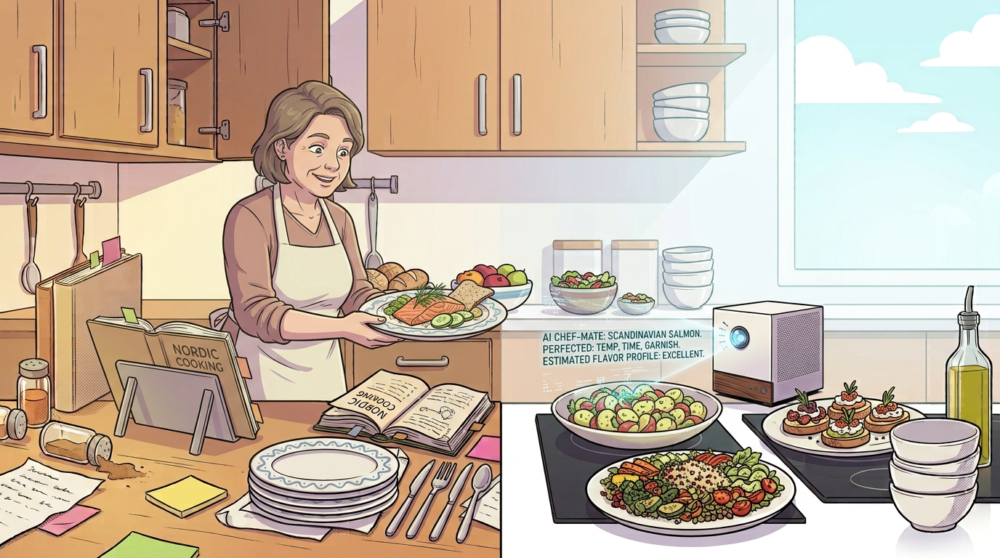

<!-- 

-->

# Smarte Rezept-Automation 
### mit Mealie, Docker & n8n
#### ... oder warum die KI im Zweifelsfall Zwiebelsuppe kocht.

<p style="text-align: center; margin: 10px 0;">
  
</p>

**MakerTalk @ FabLab Winti**
Tobias Kammacher, 10.7.2026


<!-- 
Presenter Notes:
- Motivation: Kochen zum Entspannen.. nur sind die Rezepte sehr verteilt.
- Über Mealie gestossen: Rezept-Datenbank die das Problem löst (open source und self-hosted)
- Limitation: Rezepte einlesen nur von Website die spezielles Schema unterstützt.. AI hilft, aber man muss aufpassen
- Ziel: Die Tools die ich gefunden habe mit euch teilen und vielleicht auch eine interessante Diskussion zum Thema AI Sinn und Unsinn
-->

---

## Agenda für heute

<div class="agenda-grid">

  <div class="agenda-tile" style="border-top: 6px solid #5c2e0b;">
    <h3 style="font-size: 0.85em; margin: 0; color: #5c2e0b; font-weight: bold;">1. Kontext</h3>
    <p style="font-size: 0.55em; margin-top: 8px; line-height: 1.3; color: #666;">Rezept-Chaos & der "Tool-Belt"</p>
  </div>

  <div class="agenda-tile" style="border-top: 6px solid #8f3d00;">
    <h3 style="font-size: 0.85em; margin: 0; color: #5c2e0b; font-weight: bold;">2. Die KI</h3>
    <p style="font-size: 0.55em; margin-top: 8px; line-height: 1.3; color: #666;">Parsing, Prompts & Probleme</p>
  </div>

  <div class="agenda-tile" style="border-top: 6px solid #0022ff;">
    <h3 style="font-size: 0.85em; margin: 0; color: #5c2e0b; font-weight: bold;">3. Workflow</h3>
    <p style="font-size: 0.55em; margin-top: 8px; line-height: 1.3; color: #666;">OCR-Pipeline & Scan per Handy</p>
  </div>

  <div class="agenda-tile" style="border-top: 6px solid #22c55e;">
    <h3 style="font-size: 0.85em; margin: 0; color: #5c2e0b; font-weight: bold;">4. Demo</h3>
    <p style="font-size: 0.55em; margin-top: 8px; line-height: 1.3; color: #666;">Live-Action & Ausblick</p>
  </div>

</div>

---





<!-- 
Presenter Notes:
- Frag kurz in die Runde: "Wer von euch hat auch eine lose Zettelsammlung oder hunderte Screenshots?"
- Erkläre, dass wir heute eine smarte Pipeline bauen, die das Abtippen komplett übernimmt.
-->

---

## Das Rezept-Chaos im Alltag


<div class="columns">
<div>

* **Die Realität:**
  * Lose Zettel im Küchenschrank
  * Screenshots auf dem Smartphone (die man nie wieder findet)
  * 25 Browser-Tabs mit Rezepten
  * Ein Gestell voller Kochbücher mit Post-its
</div>
<div>

* **Die Vision:** Eine zentrale, durchsuchbare Rezept-Datenbank für die ganze Familie. Mit Meal Planning und Einkaufsliste.
</div>
</div>

* **Die Hürde:** *"Keine Lust, stundenlang Zutaten und Schritte abzutippen."*

<div class="center-box">
  
  <span style="font-size: 1.8em; font-weight: bold; color: #5c2e0b; border-bottom: 4px solid #8f3d00; padding-bottom: 5px; line-height: 1;">
    Die Lösung: Mealie
  </span>
</div>


<!-- 
Presenter Notes:
- Demo: Mealie
- evt auch Home Assistant integration
-->

---

## Die Werkzeuge

*  **Docker:** Portables Format für Server-Applikationen
  *  **Mealie:** Rezept-Datenbank.
  *  **Paperless-ngx:** Dokumenten-Archiv für PDFs/Bilder und OCR.
  *  **n8n:** Verbindet alles visuell per Drag-and-Drop.
  * ( **Portainer:** Weboberfläche für einfaches Container-Management.)


* 🧠 **KI (LLM):** Das smarte Bindeglied für unstrukturierte Daten.
  * *In der Cloud:* ZB. Google Gemini 2.5 Flash (schnell, gratis, teils unverfügbar)
  * *Open-Source-Ausblick für zu Hause:* Ein lokales 8B-Modell (z. B. Llama 3.1 8B via Ollama) – benötigt GPU mit 6GB+ VRAM.


<!-- 
Presenter Notes:
- Betone die Offenheit: Alle diese Tools sind komplett Open-Source und selbstgehostet.
- n8n ist das Bindeglied – es klebt die APIs zusammen ohne hunderte Zeilen Python-Code.
-->

---

## Die Infrastruktur (Docker)

*Docker ist  "virtuelle Werkstatt": Jedes Tool läuft isoliert in seiner Box (Container).*

Ein Auszug aus `compose.yml`: (Konfiguration)

~~~yaml
services:
  mealie:               # Das Kochbuch
    image: ghcr.io/mealie-recipes/mealie:latest
    ports: ["9925:80"]  # Erreichbar im Browser unter Port 9925
  n8n:                  # Der API-Dirigent
    image: docker.n8n.io/n8nio/n8n:latest
...
~~~

* Die Container kommunizieren isoliert über das interne Docker-Bridge-Netzwerk.
* Ermöglicht eine einfache, reproduzierbare Konfiguration und die volle Kontrolle über die installierten Container-Versionen (zB. `:1.4.2` anstatt `:latest`).

<!-- 
Presenter Notes:
- Für die Tech-Interessierten: Lokales Routing über IPs (z. B. 192.168.1.X) oder Servicenamen.
- Erwähne, dass man diese Dienste super über Reverse Proxies wie Traefik absichern kann.
-->

---

## Mealie Rezept Import (Idealfall)

* Wie kommen Rezepte in die Mealie Datenbank? 
  * **Import:** Rezept "Scraper", liest automatisch eine Website aus
  * **Create:** Manuelle Eingabe

<div class="center-box">

</div>

<!-- 
Presenter Notes:
- Beispiel Rezept Import zeigen
- Wieso geht das so einfach? -> Nächste Folie
-->

---

## Mealie Rezept Import (Idealfall)

* **Wie Mealie Webseiten liest (Rezept Scraper):** Viele moderne Koch-Blogs liefern standardisierte Metadaten für Google & Co.
  * Mealie nutzt ein Format namens **JSON-LD** (JavaScript Object Notation for Linked Data).
* **Das erwartete Schema (Beispiel):**

~~~json
{
  "@context": "https://schema.org",
  "@type": "Recipe",
  "name": "Safran-Tagliatelle",
  "recipeIngredient": ["250g Tagliatelle", "0.1g Safran"],
  "recipeInstructions": [{"@type": "HowToStep", "text": "Pasta kochen und Safran einrühren."}]
}
~~~

* Somit kann Mealie das Rezept in Sekunden perfekt einlesen


---

## Die Hürde: Wenige Rezepte im JSON-LD Format

* Viele private Blogs, ältere oder absichtlich geschützte Webseiten bieten keine strukturierten Metadaten – der native Scraper sieht nichts.

* **Klassische Programmierung (Regex / CSS-Selektoren):**
  * *Suche nach `<span class="ingredient">`*
  * Unterschiedlich für jede Seite. Scheitert schon wenn Website-Design ändert.
* **Der KI-Ansatz (Semantische Übersetzung):**
  * Ein Large Language Model (LLM) liest HTML-Code wie ein Mensch.
  * Es versteht Kontext: `1 Zwiebel`, `one onion`, oder `Zwiebel (feingehackt): 1 Stk.` – für die KI ist es dasselbe Konzept.
  * Das Ziel ist Übersetzung von chaotischem Input in ein standardisiertes Schema (JSON-LD).

<!-- 
Presenter Notes:
- Der philosophische Kern des Talks: KI als pragmatischer "Parser" für unstrukturierte Daten.
- Es gibt kein festes Schema im Web für Rezepte, also nutzen wir ein Tool, das mit Unschärfe umgehen kann.
-->

---

## Exkurs: Automatisierung mit n8n


* Workflow um Rezepte nicht-unterstützter Websites trotzdem zu importieren:


1. Erzeuge ein Formular um die Rezept-URL entgegen zu nehmen.
2. n8n lädt den rohen HTML-Code der Website herunter.
3. Die KI liest den HTML-Salat und extrahiert Name, Zutaten und Schritte und wandelt die Daten ins JSON-LD Schema um.
4. Die Daten landen vollautomatisch in Mealie.


<!-- 
Presenter Notes:
- Demo?
-->

---

## Das Gehirn konfigurieren (AI Prompt)

<style scoped>
  /* Zwingt alle Code-Blöcke auf DIESER Folie, kleiner zu sein */
  code {
    font-size: 70% !important;
    line-height: 1.15;
  }
</style>

* Wir füttern die KI nicht mit Fragen, sondern mit einem präzisen "Arbeitsauftrag" (System Prompt) als Rezept Parser.

~~~text
"You are an expert culinary data extractor. Analyze the following web page text and extract 
the recipe. You MUST return ONLY a clean JSON object fitting the Mealie recipe schema. 
Do not write conversational text or code blocks."

Here is an example of the mealie target JSON structure:
{
  "name": "Recipe Title",
  "description": "Short description",
  "recipeYield": "4 servings",
  "recipeIngredient": [
    {"note": "1 tbsp olive oil"},
    {"note": "2 cloves garlic, minced"}
  ],
  "recipeInstructions": [
    {"text": "Heat oil in a pan over medium heat."},
    {"text": "Add garlic and sauté until fragrant."}
  ]
}
~~~

---

## Was passiert, wenn der Workflow einen Bug hat?

* **Der Fehler:** n8n übergab Gemini eine leere Variable (`undefined`) statt des Rezept-Texts.
* **Die Reaktion der KI:** Statt eine Fehlermeldung auszugeben, wollte Gemini unbedingt den System-Prompt erfüllen ("Liefere ein gültiges Rezept-JSON").
* **Die Halluzination:** Aus dem Nichts erfand die KI ein makelloses Rezept für **französische Zwiebelsuppe** (inkl. Gruyère-Toast), da dies statistisch ein sehr "typisches" Rezept in den Trainingsdaten war!

<div class="center-box" style="bottom: 10px;">
  
</div>

<!-- 
Presenter Notes:
- Der lustigste Teil des Talks
- KIs wollen immer gefallen. Wenn man ihnen nichts gibt, erfinden sie einfach etwas plausibel Klingendes.
-->

---

## Prompt-Engineering 

* KI Prompt ist eine schwammige Lösung für einen schwammigen Input.
* Wie wir die KI zähmen und Halluzinationen verhindern:

1. **Strict Negative Constraints:** *"NO HALLUCINATIONS: You must extract ONLY the recipe described in the OCR text. Never substitute or invent a different recipe."*
2. **Sprach-Verankerung (Language Locking):** *"Keep all recipe content in the ORIGINAL language (German). Do not translate."*
3. **Umgang mit fehlerhaftem OCR:** *"Correct obvious scanning typos: '1Y2dl' means '1.5 dl', 'r Zwiebel' means '1/2 Zwiebel'."*

<!-- 
Presenter Notes:
- Erkläre, wie diese drei simplen Regeln im System-Prompt die Fehlerquote bei der Texterkennung drastisch gesenkt haben.
- Indem wir die KI zwingen, auf Deutsch zu arbeiten, bleibt sie eng an dem deutschen OCR-Text.
- ACHTUNG: Wenn was schief geht, wird aus dem Rezept dafür Schaschlik..
-->

---

## Rezept Scan per Handy

Wie wir gedruckte Kochbücher ohne Abtippen importieren:

1. Kochbuch aufschlagen, Foto mit der "Paperless Mobile" App schiessen.
2. Paperless-ngx liest das Bild ein und macht den Text durchsuchbar (OCR).
3. Wir weisen dem Dokument den Tag `mealie` zu.
4. Paperless triggert n8n automatisch und schickt den erkannten Text los...



<!-- 
Presenter Notes:
- Das ist der absolute Lieblings-Use-Case für Leute, die noch echte, physische Kochbücher besitzen.
- Betone, dass Paperless-ngx die Schrifterkennung (OCR) komplett offline und lokal auf dem eigenen Server macht!
-->

---

## AI Prompt für Umwandlung von OCR

~~~text
You are a strict, literal OCR-to-Recipe data extraction engine. Your sole task is to extract the 
recipe from the provided messy OCR text and format it as a valid Schema.org/Recipe JSON object.

CRITICAL RULES:
NO HALLUCINATIONS: You must extract ONLY the recipe described in the OCR text below. Never substitute 
or invent a different recipe.
PRESERVE LANGUAGE: Keep all recipe content (name, description, ingredients, instructions) in the ORIGINAL 
language of the OCR text 
(German or English). Do not translate German to English.
OCR CLEANUP: Correct obvious scanning typos sensibly:

"aaaen|" is noise, ignore it.

"1Y2dl" or "112 dl" means "1.5 dl" or "1 1/2 dl" (decide based on context).

"r Zwiebel" means "1 Zwiebel" or "1/2 Zwiebel".

Do NOT add ingredients (like beef broth, baguettes, cheese) that are not mentioned in the source OCR text.

FORMAT: Return ONLY the raw JSON object. Do not wrap it in markdown code blocks (no ```json). Do not add 
any conversational text.

SOURCE OCR TEXT:

{{ $json.content }}
~~~

---

## Der Paperless ➔ n8n Pipeline-Bau (Details..)

Die technischen Hürden beim Verbinden zweier lokaler Container:

* **Das Jinja2-Format in Paperless:** Wir nutzen den Parameter `{{doc_url}}` im Webhook-Body, um n8n mitzuteilen, welches Dokument verarbeitet werden soll.
* **Die ID-Extraktion mit Regex in n8n:**
  Wir extrahieren die Dokumenten-ID elegant im URL-Feld des HTTP-Nodes:
  `http://192.168.1.2:8010/api/documents/{{ $json.body.document_url.match(/documents\/(\d+)/)[1] }}/`
* **Das Token-Geheimnis:** Authentifizierung via API-Token im HTTP-Header (`Authorization: Token <key>`).

<!-- 
Presenter Notes:
- Zeige den Makern, wie n8n mit regulären Ausdrücken (Regex) direkt im URL-Feld arbeiten kann.
- Erkläre kurz den Docker-Sicherheitseffekt durch den API-Token.
-->

---

## Live-Demo

1. **Demo 1:** Import einer Website in Mealie mit JSON-LD.
1. **Demo 2:** Import einer Website über das n8n-Formular.
2. **Demo 3:** Rezept mit "Paperless Mobile" App scannen; automatische Auslösung des Workflows.

<!-- 
Presenter Notes:
- Wechsle jetzt auf deinen geteilten Bildschirm oder projiziere dein Handy-Screen.
- Zeige zuerst n8n (wie die Knoten bereitstehen), lade dann das Foto in Paperless hoch, setze das Tag "mealie" und lass alle zuschauen.
-->

---

## Fazit & Ausblick




* **Was ich gelernt habe:**
  * Docker Container als stabile Grundlage für vielfältige Open-Source Projekte.
  * n8n ist ein Allzweck-Tool für API-Integrationen.
  * KI (LLMs) eignet sich als Parser für unstrukturierte Daten; mit gewissen Gefahren..
* **Wie es weitergeht (Zukunftsprojekte):**
  * **100% lokal:** Cloud-KI durch lokale Modelle ersetzen (z.B. Ollama direkt auf dem Homeserver).
  * **Rezept Foto:** Automatisiertes scrapen des Fotos direkt ins Mealie Rezept.
* Alle Infos unter https://github.com/kr4ch/smarte-rezept-datenbank

**Fragen? Diskussion?**

<!-- 
Presenter Notes:
- Vielen Dank für eure Aufmerksamkeit!
- Öffne die Runde für Fragen: "Gibt es Fragen zur Docker-Konfiguration, zum n8n-Workflow oder zum Prompt-Engineering?"
-->